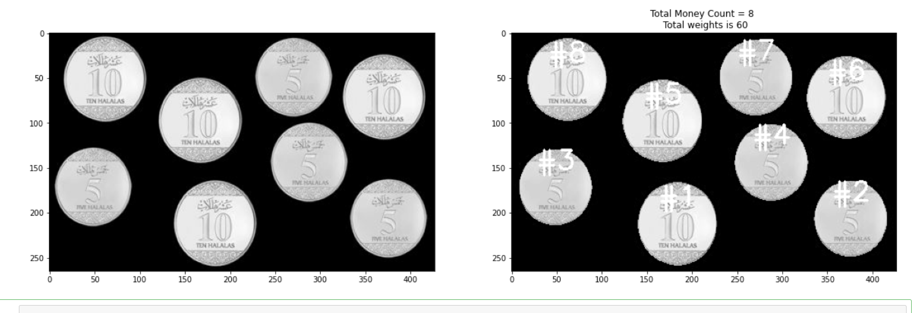

# detect_coins_weights

## In this Notebook I try to Count number of coins and calculate the total sum 

### Using this preprocssing teqhniques: Image blur, Canny edge detection, Dilate, Find contours, moments(to find postion), contourArea(to map each circle area to specific ammount of cash.)

### as example coins of amount 5 has area 52-59 and amount of 10 has areay 68-69 

## Final results it is looks like this

### Refrence:

<ul> 
  <li>https://medium.com/analytics-vidhya/detecting-and-counting-objects-with-opencv-b0f59bc1e111 </li>
<li>https://www.pyimagesearch.com/2016/02/01/opencv-center-of-contour/ </li>
</ul>
